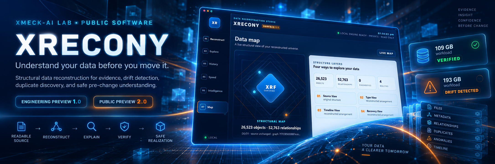

  

<h1 align="center">XRECONY</h1>

  <strong>Understand your data before you move it.</strong>

  Windows data-reconstruction software for readable data estates. 
  Build a structural twin, inspect relationships, surface duplicate/version candidates,
  detect drift, verify evidence, and plan change without intentionally modifying the source.

  <strong>XRECONY 2.0 · Public Preview</strong> 
  Windows · Read-only reconstruction · Evidence-backed · Active development

  <a href="https://github.com/XMECK-LAB/XRECONY/releases">Releases</a> ·
  <a href="#what-xrecony-does">Capabilities</a> ·
  <a href="#engineering-evidence">Evidence</a> ·
  <a href="docs/ARCHITECTURE.md">Architecture</a> ·
  <a href="docs/ROADMAP.md">Roadmap</a> ·
  <a href="demo/index.html">Demo</a>

  <a href="https://github.com/XMECK-LAB"><strong>XMECK-LAB</strong></a>
  &nbsp;·&nbsp;
  <a href="https://github.com/raajmandale"><strong>Raaj Mandale</strong></a>
  &nbsp;·&nbsp;
  <a href="https://raajmandale.github.io/XPADI-SGDS/lsdr/"><strong>XPADI-SGDS research lineage</strong></a>

---

## Why XRECONY exists

Storage keeps getting cheaper. Understanding long-lived data estates does not.

**XRECONY** is a Windows reconstruction workspace for readable data estates. It builds an evidence-backed structural twin in a **separate workspace** so you can understand what exists, how it relates, where duplication or version candidates may exist, what changed, and what can be safely copied elsewhere — **without intentionally modifying the source**.

> ### THE SOURCE REMAINS THE SOURCE.

XRECONY is useful for messy external drives, archive folders, migration sets, mounted NAS/SMB shares, old laptop estates and long-lived backup collections where **understanding should come before reorganization**.

  

## What XRECONY does

- **Reconstructs readable storage** into a separate structural workspace.
- **Builds multiple views** across source, type, timeline and recovery perspectives.
- **Surfaces duplicate and version-family candidates** as evidence to investigate — not automatic deletion decisions.
- **Compares generations** and reports structural drift.
- **Produces evidence and exports** for review and verification.
- **Supports copy-first Safe Realization** to a separate destination in 2.0.
- **Fails honestly**: a completed run is not automatically called verified.

### Where it fits

XRECONY is intentionally different from a backup tool, damaged-media recovery utility, file manager or destructive deduplicator.

| Tool family | Primary job | XRECONY's role |
|---|---|---|
| Backup / snapshot | Preserve and restore content | Understand a readable estate before change |
| Deleted-file / disk recovery | Recover lost or damaged content | Reconstruct readable structure and evidence |
| Duplicate finder | Identify matching files | Surface duplicate/version candidates in a wider structural model |
| File manager | Browse and manipulate files | Build reconstructed views, generations, relationships and evidence |

  

## Current capability boundary

| Capability | State |
|---|---|
| Local folders | **Supported** |
| Mounted HDD / SSD | **Supported** |
| Mounted SMB / NAS | **Supported** |
| Portable metadata manifest | **Supported** |
| Structural reconstruction | **Supported** |
| Source / Type / Timeline / Recovery views | **Supported** |
| Duplicate candidates | **Supported** |
| Version-family candidates | **Supported** |
| Generation comparison | **Supported** |
| Drift detection | **Supported** |
| Evidence / report exports | **Supported** |
| Safe copy realization | **Supported in 2.0** |
| Native Google Drive | **Unavailable pending release qualification** |
| Native Dropbox | **Unavailable pending release qualification** |
| Native OneDrive / SharePoint | **Unavailable pending release qualification** |
| 25 TB / ~45 min objective | **Research target — not proven** |

## Engineering evidence

These are **founder-machine observations**, not universal speed claims.

  
  

### 109 GB observed workload — VERIFIED

- 20,467 filesystem objects
- 19,022 files
- 1,445 folders
- 2.15 s measured runtime
- 9,540 records/s
- 0 errors

### 193 GB observed workload — DRIFT DETECTED

- 553,708 filesystem objects
- 497,615 files
- 56,088 folders
- 1,468,104 structural relationships
- 6m 15.2s observed runtime
- 5 diagnostics

The second result is deliberately public. XRECONY surfaced **DRIFT DETECTED** rather than manufacturing a clean verification state.

Data size alone does not define reconstruction complexity. Object population, directory topology, storage behaviour, metadata shape, cache state and workload composition materially affect runtime.

Full evidence: [docs/BENCHMARKS.md](docs/BENCHMARKS.md)

## Product surface

  
  

The interface keeps the core boundary visible: **source**, **separate reconstruction workspace**, **measured state**, **evidence**, and **bounded realization**.

## Public release model

XRECONY intentionally keeps public versioning simple.

| Public line | Meaning |
|---|---|
| **v1.0.0 — Engineering Preview** | First public engineering release distilled from the mature pre-2.0 working lineage |
| **v2.0.0 — Public Preview** | Current product line with a more complete evidence-backed workflow and larger observed workloads |

Internal Surface / XRF / RSF / V4–V11 / LSDR terminology remains engineering history and is not used as public product numbering.

### Download

Normal users should use **[GitHub Releases](https://github.com/XMECK-LAB/XRECONY/releases)** for Windows release artifacts.

Developers and reviewers can inspect the public source/history exposed by this repository. Release binaries are kept separate from the repository source tree.

## Roadmap

XRECONY is useful today, but the original reconstruction vision is **not finished**.

Current engineering focuses on:

- controlled multi-TB benchmark qualification;
- stronger content-level duplicate evidence;
- better version-family differentiation;
- deeper relationship and drift explanations;
- provider-specific authentication, pagination and revocation qualification;
- signed Windows artifacts and clean-machine lifecycle;
- continued progress toward a longer-term 25 TB-class reconstruction research objective.

See [docs/ROADMAP.md](docs/ROADMAP.md).

## Ecosystem map

XRECONY sits at the intersection of three identities with different roles:

| Identity | Role |
|---|---|
| **[XMECK-LAB](https://github.com/XMECK-LAB)** | Public software/startup organization and product home |
| **[Raaj Mandale](https://github.com/raajmandale)** | Creator, founder, systems architect and independent research identity |
| **[XPADI-SGDS](https://github.com/raajmandale/XPADI-SGDS)** | Broader survivability / structural-reconstruction research lineage |

XRECONY is the **working reconstruction software surface**. XPADI-SGDS is the broader survivability research architecture. They are linked by lineage and reconstruction direction, but they are not the same product.

  <strong>Research → Engineering → Working Software</strong>

More detail: [docs/XMECK_ECOSYSTEM.md](docs/XMECK_ECOSYSTEM.md)

## Citation

If XRECONY contributes to research, technical evaluation or published work, please cite the software using [CITATION.cff](CITATION.cff).

**Creator:** [Raaj Mandale](https://github.com/raajmandale)  
**Research identity:** [ORCID 0009-0005-9810-1655](https://orcid.org/0009-0005-9810-1655)  
**Organization:** [XMECK-LAB](https://github.com/XMECK-LAB)  
**Repository:** [XMECK-LAB/XRECONY](https://github.com/XMECK-LAB/XRECONY)

## Research lineage

XRECONY is associated with the broader **XPADI-SGDS** survivability and structural-reconstruction direction.

- [XPADI-SGDS repository](https://github.com/raajmandale/XPADI-SGDS)
- [XRECONY / LSDR public research evidence](https://raajmandale.github.io/XPADI-SGDS/lsdr/)
- [XPADI-SGDS research record](https://zenodo.org/records/19500143)

## Status and claim boundary

**Public Preview · Active development**

XRECONY is real working engineering software, but it is not presented as a finished commercial product or as proof of every long-term research objective.

The current repository intentionally distinguishes:

**observed evidence** · **supported capability** · **unavailable capability** · **research target**

---

  Built by <a href="https://github.com/raajmandale"><strong>Raaj Mandale</strong></a>
  · Published under <a href="https://github.com/XMECK-LAB"><strong>XMECK-LAB</strong></a>

