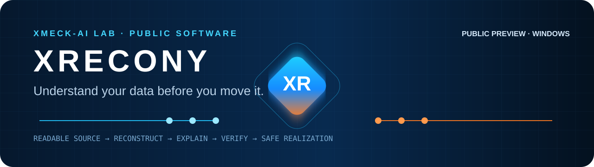
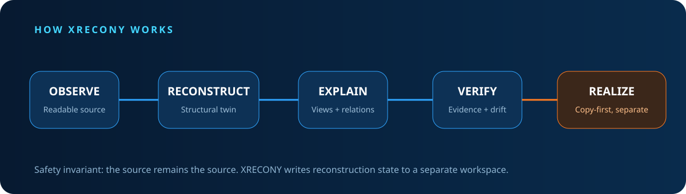

<strong>XRECONY 1.0 · Engineering Preview</strong> First public engineering release · Windows · source-preserving reconstruction

---

# XRECONY 1.0 — Engineering Preview

**Understand your data before you move it.**

XRECONY 1.0 is the first public engineering release of the XRECONY reconstruction system. It observes readable local or mounted storage and builds a separate structural reconstruction without intentionally modifying the original source.

This public release is derived from the mature pre-2.0 working lineage. Internal Surface/XRF/RSF and V4–V11 terminology is preserved as engineering history rather than exposed as public version numbering.

## Useful today

- understand messy HDD/SSD or mounted NAS structures;
- reconstruct file/folder relationships into a separate workspace;
- inspect source/type/timeline/recovery-oriented views;
- surface duplicate **candidates** and likely version families;
- review large-file, empty-folder and project/root patterns;
- verify generated evidence and receipts;
- compare reconstruction generations without reorganizing the original source.

## Safety

> **THE SOURCE REMAINS THE SOURCE.**

XRECONY writes working state to a separate workspace. It is not deleted-file recovery, disk repair, backup replacement or destructive deduplication.

## Build and test

1. Use a supported Windows/Python environment.
2. Run `RUN_TESTS.bat`.
3. Launch with `START_XRECONY.bat`.
4. Select a readable source and a separate writable workspace.
5. Reconstruct, inspect and verify.

Standalone Windows build: `BUILD_WINDOWS_EXE.bat`.

## Public evolution

- **XRECONY 1.0 — Engineering Preview**: this line.
- **XRECONY 2.0 — Public Preview**: current product line with stronger evidence workflows, larger observed workloads and safer productization.

## Research lineage

XRECONY is related to the broader XPADI-SGDS survivability and structural-reconstruction research direction.

## XMECK-AI LAB

Published as part of the **XMECK-AI LAB** software ecosystem. Created by **Raaj Mandale**.
