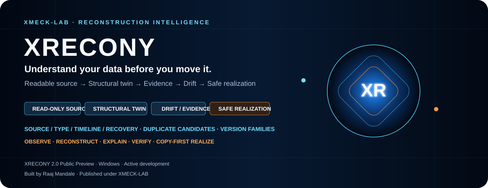
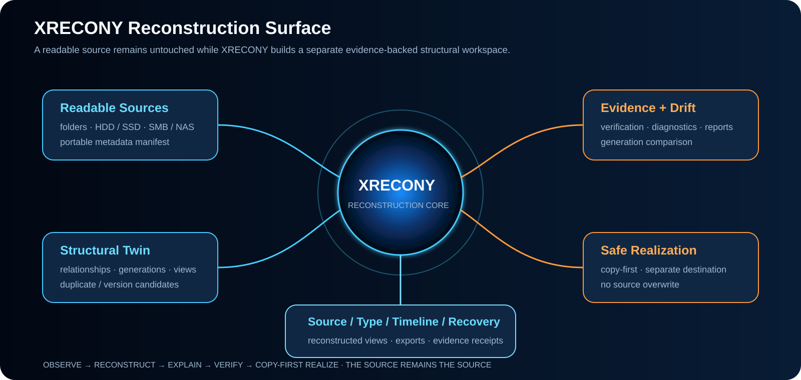
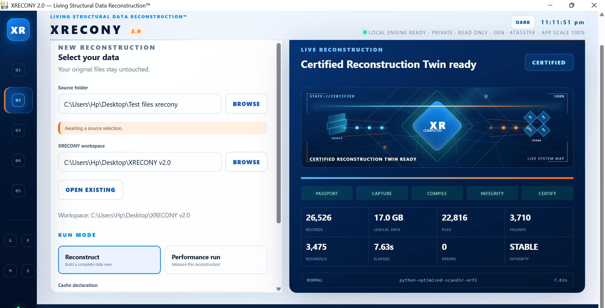
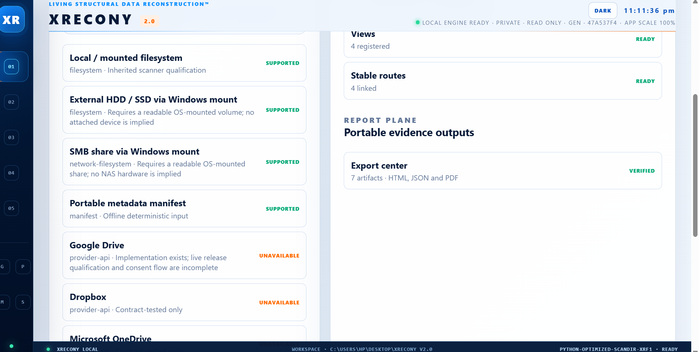
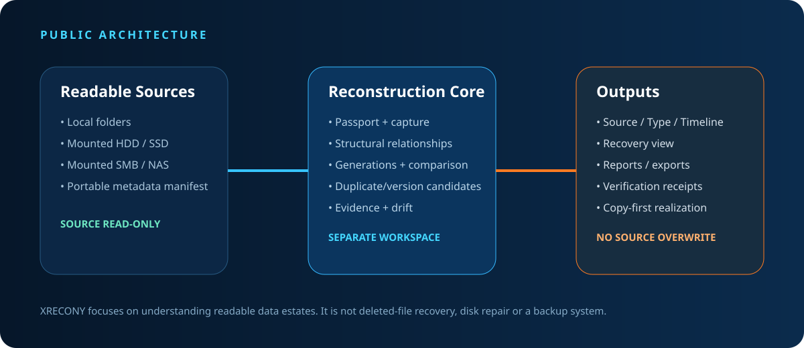
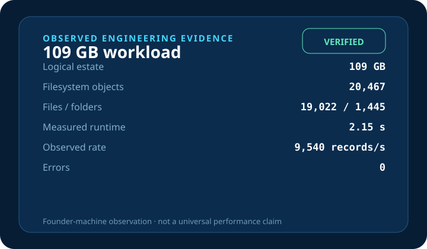
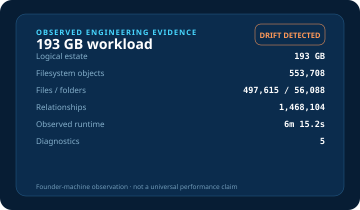
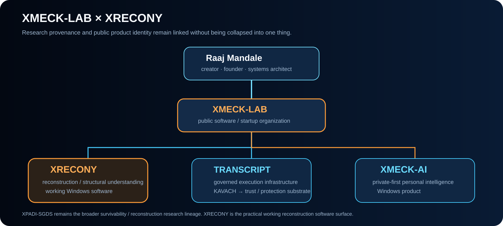
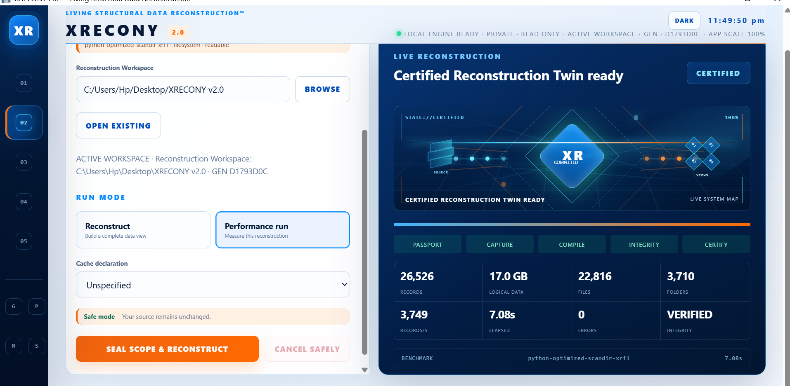
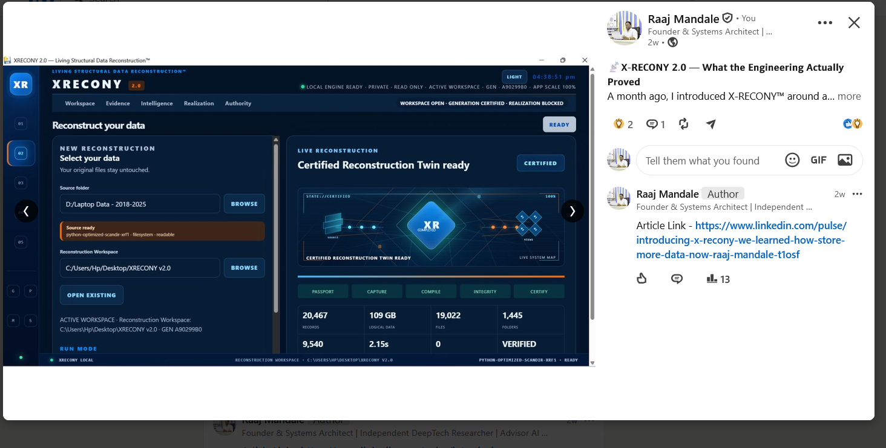

<p align="center">
  
</p>

<h1 align="center">🧬 XRECONY</h1>

<p align="center">
  <b>Reconstruction Intelligence for Readable Data Estates</b><br>
  Structural Twin • Relationships • Drift • Evidence • Copy-First Realization
</p>

<div align="center">

[](https://github.com/XMECK-LAB/XRECONY)
[](docs/ARCHITECTURE.md)
[](https://github.com/XMECK-LAB/XRECONY/tree/main)
[](docs/ROADMAP.md)
[](https://github.com/raajmandale)

<br>

[](https://github.com/XMECK-LAB/XRECONY/releases/latest/download/XRECONY-2.0.0-Windows-x64-Setup.exe)
[](https://github.com/XMECK-LAB/XRECONY/releases/latest/download/XRECONY-2.0.0-Windows-x64-Public-Release.zip)
[](https://github.com/XMECK-LAB/XRECONY/tree/release/2.x)
[](https://github.com/XMECK-LAB/XRECONY/tree/release/1.x)
[](demo/index.html)
[](docs/BENCHMARKS.md)

</div>

<p align="center">
  <i>Understand your data before you move it.</i>
</p>

---

# 🌐 Reconstruction Intelligence Surface

<p align="center">
  
</p>

XRECONY is Windows reconstruction software for **readable data estates**.

It builds an evidence-backed structural twin in a **separate workspace** so you can understand what exists, how it relates, where duplicate or version candidates may exist, what changed, and what can be safely copied elsewhere.

> ## **THE SOURCE REMAINS THE SOURCE.**

XRECONY is intentionally designed to understand before reorganizing.

---

# ⚡ What XRECONY Does

| Surface | Product role |
|---|---|
| 📂 **Readable Sources** | Local folders, mounted HDD/SSD, mounted SMB/NAS, portable metadata manifest |
| 🧬 **Structural Twin** | Reconstructed source, type, timeline and recovery views |
| 🔗 **Relationships** | Structural relationship graph across the readable estate |
| 🧩 **Duplicate Candidates** | Evidence to investigate — not automatic deletion decisions |
| 🧾 **Version Families** | Candidate grouping for version-oriented review |
| 🕒 **Generations** | Compare captures across time |
| ⚠️ **Drift Detection** | Surface structural differences and diagnostics |
| 🔍 **Evidence / Reports** | Exports and verification-oriented evidence |
| 📦 **Safe Realization** | Copy-first realization to a separate destination in 2.0 |

<p align="center">
  
  
</p>

---

# 🚀 Download XRECONY 2.0

### Windows x64

[**⬇ Download XRECONY 2.0 for Windows**](https://github.com/XMECK-LAB/XRECONY/releases/latest/download/XRECONY-2.0.0-Windows-x64-Setup.exe)

[**📦 Download Complete Public Release Package**](https://github.com/XMECK-LAB/XRECONY/releases/latest/download/XRECONY-2.0.0-Windows-x64-Public-Release.zip)

**Installer SHA-256**

```text
B55152AD66E95338FDE5DD9E836B0B1738AC9F42C59DB9FC7361794E39500F7E
```

**Public release ZIP SHA-256**

```text
114B3585F235F6AA2D2DADEB042DE82FD03CA54A84F950E12FA62100B07A19E1
```

The complete release package contains the Windows installer, verification material, provenance, SBOM, source manifest and release documentation.

➡️ [**Open XRECONY 2.0 Release**](https://github.com/XMECK-LAB/XRECONY/releases/tag/v2.0.0)

---

# 🧬 Public Version Lines

XRECONY intentionally keeps public versioning simple.

| Public line | Meaning | Public surface |
|---|---|---|
| 🧪 **XRECONY 1.0 Engineering Preview** | First public line distilled from the mature pre-2.0 working lineage | [`release/1.x`](https://github.com/XMECK-LAB/XRECONY/tree/release/1.x) |
| 🧬 **XRECONY 2.0 Public Preview** | Current product line with the complete public reconstruction workflow | [`release/2.x`](https://github.com/XMECK-LAB/XRECONY/tree/release/2.x) |
| 🌐 **main** | Current public product presentation, documentation and discovery surface | [`main`](https://github.com/XMECK-LAB/XRECONY/tree/main) |

Binary delivery is published through the GitHub Release so users can download XRECONY directly from this README without navigating through Tags.

Internal Surface / XRF / RSF / V4–V11 / LSDR terminology remains engineering history and is not used as public product numbering.
---

# 🏛️ Architecture

<p align="center">
  
</p>

```text
READABLE SOURCE
      ↓
PASSPORT / CAPTURE
      ↓
STRUCTURAL RELATIONSHIPS
      ↓
GENERATIONS / COMPARISON
      ↓
DUPLICATE + VERSION CANDIDATES
      ↓
EVIDENCE / DRIFT
      ↓
RECONSTRUCTED VIEWS
      ↓
COPY-FIRST REALIZATION
```

### Safety invariant

```text
SOURCE
  ≠
WORKSPACE
  ≠
REALIZATION DESTINATION
```

The source is readable input. Reconstruction state is written to a separate workspace. Supported realization is copy-first to a separate destination.

➡️ [`docs/ARCHITECTURE.md`](docs/ARCHITECTURE.md)

---

# 🔬 Observed Reconstruction Evidence

These are observed reconstruction workloads, not universal speed guarantees.

<p align="center">
  
  
</p>

## ✅ 109 GB Observed Workload — VERIFIED

| Measure | Observation |
|---|---:|
| Filesystem objects | 20,467 |
| Files | 19,022 |
| Folders | 1,445 |
| Measured runtime | 2.15 s |
| Records / second | 9,540 |
| Errors | 0 |

## ⚠️ 193 GB Observed Workload — DRIFT DETECTED

| Measure | Observation |
|---|---:|
| Filesystem objects | 553,708 |
| Files | 497,615 |
| Folders | 56,088 |
| Structural relationships | 1,468,104 |
| Observed runtime | 6m 15.2s |
| Diagnostics | 5 |

The second result is deliberately public. XRECONY reported **DRIFT DETECTED** instead of manufacturing a clean verification state.

Data size alone does not define reconstruction complexity. Object population, topology, storage behaviour, metadata shape, cache state and workload composition materially affect runtime.

➡️ [`docs/BENCHMARKS.md`](docs/BENCHMARKS.md)

---

# 🧭 Where XRECONY Fits

XRECONY is not trying to be every storage tool.

| Tool family | Primary job | XRECONY's role |
|---|---|---|
| 💾 Backup / snapshot | Preserve and restore content | Understand a readable estate before change |
| 🧯 Deleted-file / damaged-media recovery | Recover lost or damaged content | Reconstruct readable structure and evidence |
| 🧹 Duplicate finder | Identify matching files | Surface duplicate/version candidates in a wider structural model |
| 📁 File manager | Browse and manipulate files | Build reconstructed views, generations, relationships and evidence |

---

# 🌌 XMECK-LAB × XRECONY

<p align="center">
  
</p>

| Identity / Product | Role |
|---|---|
| 👤 **Raaj Mandale** | Creator · founder · systems architect · independent research identity |
| 🧩 **XMECK-LAB** | Public software / startup organization and product home |
| 🧬 **XRECONY** | Reconstruction / structural-understanding working software |
| ⚙️ **TRANSCRIPT** | Governed execution infrastructure |
| 🛡️ **KAVACH** | Trust / protection substrate under TRANSCRIPT |
| 🧠 **XMECK-AI** | Private-first personal intelligence workspace |
| 🔬 **XPADI-SGDS** | Broader survivability / structural-reconstruction research lineage |

### Identity law

- **Raaj Mandale** remains the creator / research identity.
- **XMECK-LAB** is the public software organization.
- **XRECONY** is a working reconstruction product line.
- **XMECK-AI** is a separate public product line.
- **XPADI-SGDS** is broader research lineage, not the same product as XRECONY.
- Older research repositories are not silently relabeled as XMECK-LAB products.

---

# 🧬 Research → Engineering → Working Software

```text
XPADI-SGDS
survivability / reconstruction research
        ↓
reconstruction direction
        ↓
XRECONY
working reconstruction software
```

XRECONY does **not** claim to implement the whole XPADI-SGDS survivability architecture.

It is the practical reconstruction software surface associated with the structural-reconstruction direction.

Research lineage:
- [XPADI-SGDS repository](https://github.com/raajmandale/XPADI-SGDS)
- [XRECONY / LSDR research evidence](https://raajmandale.github.io/XPADI-SGDS/lsdr/)
- [XPADI-SGDS research record](https://zenodo.org/records/19500143)

---

# 🖼️ Product Gallery

### 🧬 Reconstruction capabilities

<p align="center">
  
</p>

### 🔬 109 GB observed workload

<p align="center">
  
</p>

### ⚠️ 193 GB drift-detected workload

<p align="center">
  
</p>

---

# 🧾 Capability / Claim Boundary

| Capability | Current public state |
|---|---|
| Local folders | ✅ Supported |
| Mounted HDD / SSD | ✅ Supported |
| Mounted SMB / NAS | ✅ Supported |
| Portable metadata manifest | ✅ Supported |
| Structural reconstruction | ✅ Supported |
| Source / Type / Timeline / Recovery views | ✅ Supported |
| Duplicate candidates | ✅ Supported |
| Version-family candidates | ✅ Supported |
| Generation comparison | ✅ Supported |
| Drift detection | ✅ Supported |
| Evidence / report exports | ✅ Supported |
| Safe copy realization | ✅ Supported in 2.0 |
| Native Google Drive | ⛔ Unavailable pending release qualification |
| Native Dropbox | ⛔ Unavailable pending release qualification |
| Native OneDrive / SharePoint | ⛔ Unavailable pending release qualification |
| 25 TB / ~45 min objective | 🔬 Research target — not proven |

---

# 🎯 Product Position

XRECONY's strongest product position is not "fast file scanning."

It is:

> **Evidence-backed structural reconstruction for readable data estates, where understanding comes before reorganization.**

The product is strongest when a user needs to answer:

- What actually exists here?
- How is it structurally related?
- Which files look duplicated or version-related?
- What changed between generations?
- Is the reconstruction verified, or did drift occur?
- What can be safely copied elsewhere without rewriting the source?

---

# 🗺️ Roadmap Discipline

Current engineering focuses on:

- controlled 100 GB–1 TB+ workload qualification;
- object-count / topology-aware benchmarking;
- stronger content-level duplicate evidence;
- better version-family differentiation;
- deeper relationship and drift explanations;
- provider-specific authentication / pagination / revocation qualification;
- signed Windows artifacts;
- clean-machine lifecycle qualification;
- reproducible release manifests;
- update strategy.

### Long-term research objective

**25 TB-class reconstruction around ~45 minutes remains a research target, not a current product claim.**

➡️ [`docs/ROADMAP.md`](docs/ROADMAP.md)

---

# 📚 Documentation Surface

| Surface | Link |
|---|---|
| 🏛️ Architecture | [`docs/ARCHITECTURE.md`](docs/ARCHITECTURE.md) |
| 🔬 Benchmarks | [`docs/BENCHMARKS.md`](docs/BENCHMARKS.md) |
| 🗺️ Roadmap | [`docs/ROADMAP.md`](docs/ROADMAP.md) |
| 🧬 History | [`docs/HISTORY.md`](docs/HISTORY.md) |
| 🌌 XMECK ecosystem | [`docs/XMECK_ECOSYSTEM.md`](docs/XMECK_ECOSYSTEM.md) |
| 🛡️ Security | [`SECURITY.md`](SECURITY.md) |
| 📜 Citation | [`CITATION.cff`](CITATION.cff) |

---

# 👤 Creator + Organization

## Raaj Mandale

Creator · Founder · Systems Architect · Independent Research Identity

- GitHub: https://github.com/raajmandale
- Website: https://raajmandale.in
- ORCID: https://orcid.org/0009-0005-9810-1655

## XMECK-LAB

Public software / startup organization.

- GitHub: https://github.com/XMECK-LAB
- XRECONY: https://github.com/XMECK-LAB/XRECONY
- XMECK-AI: https://github.com/XMECK-LAB/XMECK-AI

---

# 📜 License + Status

See [`LICENSE.txt`](LICENSE.txt) for the current repository rights boundary.

**Current status:** XRECONY 2.0 Public Preview · Active development.

XRECONY is working software published as a Public Preview. Long-term research objectives remain clearly separated from current product capability.

The repository deliberately distinguishes:

**observed evidence** · **supported capability** · **unavailable capability** · **research target**

---

<div align="center">

[](https://github.com/XMECK-LAB/XRECONY/releases/latest/download/XRECONY-2.0.0-Windows-x64-Setup.exe)
[](https://github.com/XMECK-LAB/XRECONY/tree/release/2.x)
[](https://github.com/XMECK-LAB/XRECONY/tree/release/1.x)
[](demo/index.html)

<br><br>

<b>XRECONY</b><br>
Understand your data before you move it.<br>
Research → Engineering → Working Software

<br><br>

Built by <a href="https://github.com/raajmandale"><b>Raaj Mandale</b></a>
&nbsp;·&nbsp;
Published under <a href="https://github.com/XMECK-LAB"><b>XMECK-LAB</b></a>

</div>
